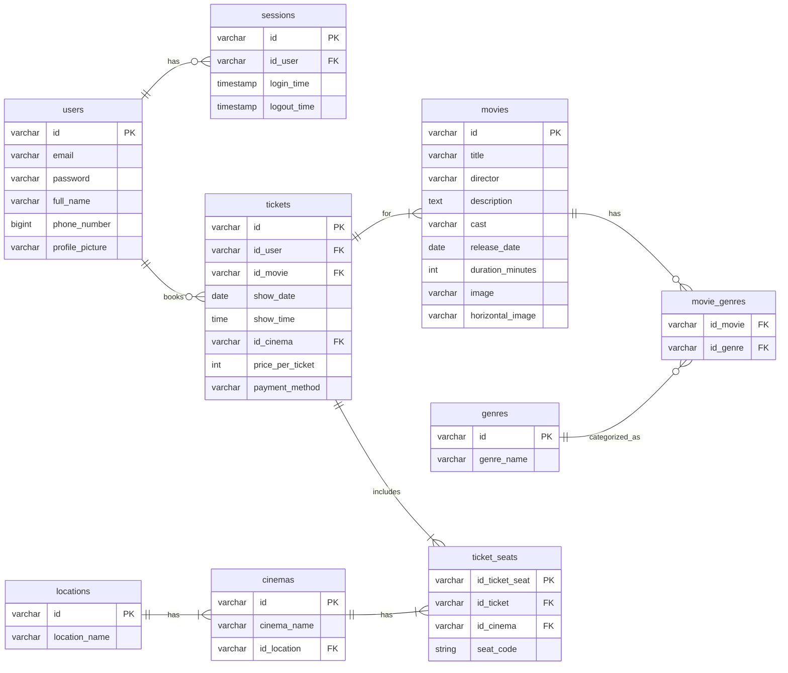

-- Active: 1750151033462@@127.0.0.1@5432@tontrix
# ENTITY-RELATIONSHIP DIAGRAM FOR TONTRIX (CINEMA TICKET BOOKING WEBAPP)

```mermaid
erDiagram
direction LR

users ||--o{ sessions : has
users ||--o{ tickets : books
movies ||--o{ movie_genres : has
genres ||--o{ movie_genres : categorized_as
tickets ||--|{ movies : for

tickets ||--|{ ticket_seats : includes

cinemas ||--|{ ticket_seats : has
locations ||--|{ cinemas : has

users {
  varchar id PK
  varchar email
  varchar password
  varchar full_name
  bigint phone_number
  varchar profile_picture
}

sessions {
  varchar id PK
  varchar id_user FK
  timestamp login_time
  timestamp logout_time
}

movies {
  varchar id PK
  varchar title
  varchar director
  text description
  varchar cast
  date release_date
  int duration_minutes
  varchar image
  varchar horizontal_image
}

genres {
  varchar id PK
  varchar genre_name
}

movie_genres {
  varchar id_movie FK
  varchar id_genre FK
}

tickets {
  varchar id PK
  varchar id_user FK
  varchar id_movie FK
  date show_date
  time show_time
  varchar id_cinema FK
  int price_per_ticket
  varchar payment_method
}

ticket_seats {
  varchar id_ticket_seat PK
  varchar id_ticket FK
  varchar id_cinema FK
  string seat_code
}

locations {
  varchar id PK
  varchar location_name
}

cinemas {
  varchar id PK
  varchar cinema_name
  varchar id_location FK
}


```