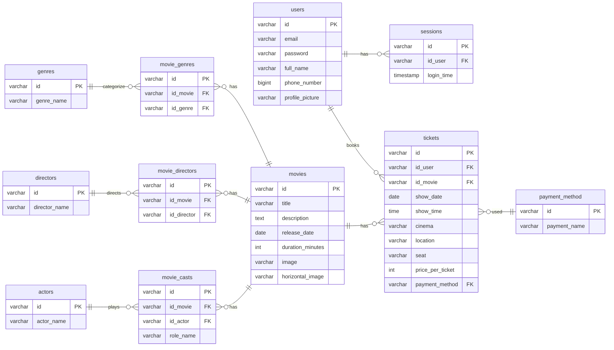

# ENTITY-RELATIONSHIP DIAGRAM FOR TONTRIX

```mermaid
erDiagram
direction LR

users ||--o{ sessions : has
users ||--o{ tickets : books
movies ||--o{ tickets : has
genres ||--o{ movie_genres : categorize
movie_genres }o--|| movies : has
directors ||--o{ movie_directors : directs
movie_directors }o--|| movies : has
actors ||--o{ movie_casts : plays
movie_casts }o--|| movies : has
tickets }o--|| payment_method : used


users {
  varchar id PK
  varchar email
  varchar password
  varchar full_name
  bigint phone_number
  varchar profile_picture
}

sessions {
  varchar id PK
  varchar id_user FK
  timestamp login_time
}

movies {
  varchar id PK
  varchar title
  text description
  date release_date
  int duration_minutes
  varchar image
  varchar horizontal_image
}

genres {
  varchar id PK
  varchar genre_name
}

movie_genres {
  varchar id PK
  varchar id_movie FK
  varchar id_genre FK
}

directors {
  varchar id PK
  varchar director_name
}

movie_directors {
  varchar id PK
  varchar id_movie FK
  varchar id_director FK
}

actors {
  varchar id PK
  varchar actor_name
}

movie_casts {
  varchar id PK
  varchar id_movie FK
  varchar id_actor FK
  varchar role_name
}

tickets {
  varchar id PK
  varchar id_user FK
  varchar id_movie FK
  date show_date
  time show_time
  varchar cinema
  varchar location
  varchar seat
  int price_per_ticket
  varchar payment_method FK
}


payment_method {
  varchar id PK
  varchar payment_name
}


```